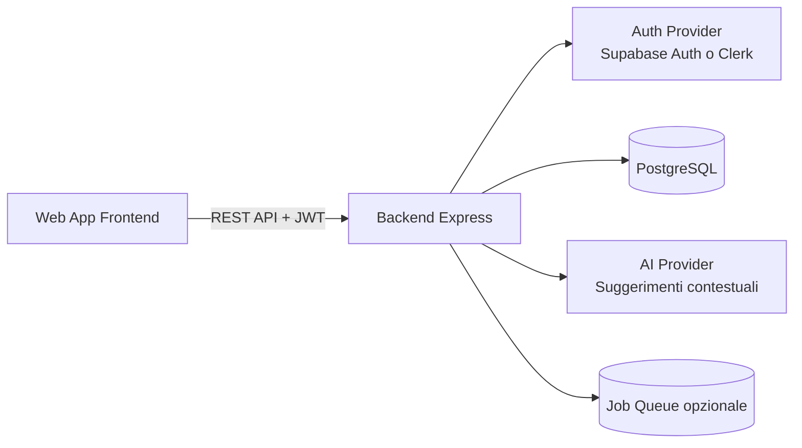

# Architettura proposta — Filo Platform v1

## Obiettivo
Evolvere il prototipo statico in una piattaforma completa con backend Node.js/Express, PostgreSQL e un dominio prodotto centrato su task + benessere (energia/stress).

## Architettura ad alto livello

## Moduli backend (modular monolith)
- **Auth Module**: verifica token, profilo utente, sessione.
- **Tasks Module**: CRUD task, stato, priorità, scadenze.
- **Wellbeing Module**: check-in giornaliero energia/stress/sonno.
- **Recommendation Module** (fase successiva): ranking task in base a priorità + costo energia + stress.
- **Analytics Module** (fase successiva): trend e KPI personali (energia media, completamento task, overload).

## Modello dati iniziale
- `users`: anagrafica utente.
- `tasks`: attività con `energy_cost` e `stress_impact`.
- `daily_checkins`: stato giornaliero utente (energia/stress/sonno).

## API v1 iniziali
- `GET /api/v1/health`
- `GET /api/v1/tasks?userId=<uuid>`
- `POST /api/v1/tasks`
- `PATCH /api/v1/tasks/:id/status`
- `PUT /api/v1/checkins/daily`
- `GET /api/v1/checkins/latest?userId=<uuid>`

## Sicurezza e qualità
- `helmet`, `cors`, validazione input con `zod`.
- Errore standardizzato con middleware centralizzato.
- Logging request con `morgan`.

## Roadmap consigliata
1. **Fase A**: stabilizzare API base + migrazioni DB.
2. **Fase B**: autenticazione reale JWT + RBAC semplice.
3. **Fase C**: motore suggerimenti energia/stress-aware.
4. **Fase D**: notifiche, calendario, integrazioni email/slack.
